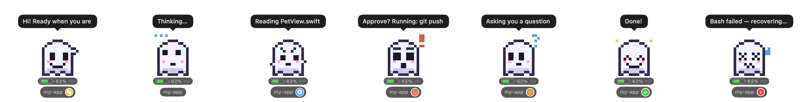
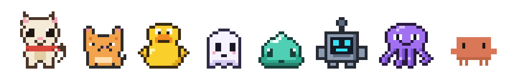
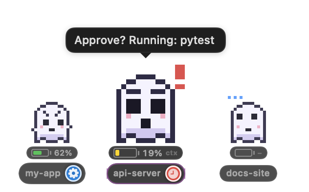

# claude-airou 🐾

A desktop pet for Claude Code. (Named after the Airou — the Felyne/Palico companion cat from Monster Hunter — because it tags along on your quests.) Like the pets in the OpenAI Codex app, a small pixel-art
creature floats in a corner of your screen and shows what Claude is doing right now:
**thinking / working / waiting for approval / needs your input / done / error**.

- Native macOS overlay (Swift, AppKit + SwiftUI). Zero dependencies, one binary.
- Driven by Claude Code **hooks**, so it works with the terminal CLI, the desktop app and IDE extensions alike.
- Always on top, never steals focus, visible on every Space and over full-screen apps. Drag it anywhere; it remembers where it was.
- Tracks several sessions at once and puts the one that needs you first.
- Pets are JSON pixel-art packs: 8 built-ins plus your own in `~/.claude-airou/pets/*.json`.
  A `/hatch-pet` skill lets Claude design new ones for you (the counterpart of Codex's `/hatch`).

[한국어 README](README.ko.md)



Built-in pets — **Airou** (the mascot: a Felyne-style hunting cat, `docs/make_airou.py`) · Mochi (cat) · Quackers (duck) · Boo (ghost) · Jelly (slime) · Bolt (robot) · Inky (octopus) · **Clawd** (the little orange creature from the Claude Code welcome screen, generated by `docs/make_clawd.py`):



## Install

Requirements: macOS 14+, a Swift 5.9+ toolchain (Xcode or the Command Line Tools).

```bash
git clone https://github.com/hyungwookc07/claude-airou.git && cd claude-airou
make install      # → ~/.local/bin/claude-airou
make hooks        # registers the hook in ~/.claude/settings.json (a backup is written first)
make statusline   # optional: feeds the battery gauge from the Claude Code status line (see below)
make skill        # optional: installs the /hatch-pet skill into ~/.claude/skills
claude-airou        # start the overlay (menu bar 🐾 icon + the pet)
```

Claude Code sessions that were already open do not re-read the hook settings; **start a new session** and the pet will react.

Start at login: `make autostart` (LaunchAgent `dev.claude-airou.overlay`; undo with `make no-autostart`).
Only one overlay runs at a time — a second `claude-airou run` prints "already running" and exits (`~/.claude-airou/overlay.lock`).

## How it works

```
Claude Code ──hook event (JSON on stdin)──▶ claude-airou hook ──▶ ~/.claude-airou/state/<session>.json
                                                                          ▲
                                                 claude-airou (overlay) ────┘ polls every 0.3 s and updates the sprite / bubble
```

| Claude Code hook event | Pet state | Shown as |
|---|---|---|
| `SessionStart` (startup/resume/clear) | hello | 👋 wave (back to idle after a few seconds) |
| `UserPromptSubmit`, `PostToolUse`, `PostToolBatch`, `PreCompact`, `SessionStart(compact)` | thinking | thought dots (the sprite's own animation) |
| `PreToolUse`, `SubagentStart` | working | ⚙️ + a one-line tool summary in the bubble ("Reading foo.swift", "Running: git status") |
| `PermissionRequest`, `Notification(permission_prompt)` | waiting_approval | 🔴 pulsing red clock — **needs your approval** |
| `PreToolUse(AskUserQuestion / ExitPlanMode)`, `Notification(agent_needs_input / elicitation_dialog)`, `Elicitation` | needs_input | 🟠 question mark — your turn |
| `Stop`, `Notification(agent_completed)` | done | ✅ green check + a hop (back to idle after a few seconds) |
| `PostToolUseFailure`, `StopFailure` | error | ❗ shake |
| `Notification(idle_prompt)` | idle | (Claude finished ~60 s ago — clears anything stuck) |
| `SessionEnd` | (session removed) | |

The hook binary never writes to stdout and always exits 0 (Claude Code feeds some events' hook stdout back into the model context). What it saw is logged to `~/.claude-airou/hook.log` (auto-truncated).

Parallel tool calls and subagents fire hooks with the same `session_id`, so the hook merges instead of blindly overwriting: while a session is waiting for approval or an answer, sibling `PostToolUse` events and subagent events are ignored; the wait clears when *that* tool call (`tool_use_id`) finishes, or on `PostToolBatch` / `Stop` / `UserPromptSubmit` (`Hook/HookMergePolicy.swift`).

### Known limitations

- **The clock lingers briefly after you approve.** Claude Code has no "user approved" hook. Approval starts the tool; the state clears when the tool finishes (`PostToolUse`), so approving a long-running command keeps the red clock up until it completes.
- **Deny / Esc have no event.** `Stop` does not fire on interrupts and a denial does not fire `PostToolUseFailure`. The next event (`PostToolBatch`, a new prompt, `idle_prompt` after 60 s) cleans up; failing that, states decay to idle by themselves (20 min for waiting/needs-input, 15 min for busy).
- To relocate the state directory set `CLAUDE_AIROU_HOME=/path` — the overlay and the hook must both see the same value.

## Usage

```
claude-airou                       run the overlay
claude-airou simulate demo         cycle through every state (no hooks needed)
claude-airou simulate waiting_approval --message "Approve? git push"
claude-airou status                the sessions the overlay currently sees
claude-airou pets                  list available pets
claude-airou validate FILE.json    validate a pet file
claude-airou render PET --out DIR  render every frame to PNG (+ sheet.png)
claude-airou preview PET           ASCII preview
claude-airou snapshot --out a.png  save a PNG of the running overlay (no screen-recording permission needed)
claude-airou install-hooks [--print]   / uninstall-hooks
```

**Click** the pet to pet it (hearts + a line of dialogue), **drag** to move, **right-click** (or the menu bar 🐾) for the menu:
choose pet · size (Small/Medium/Large) · sessions (pin one) · gauge metric · show all sessions side by side · hide speech bubbles · click-through · hide pet · reset position · install hooks · open hook log.

Under each pet: a **battery gauge** (context window remaining by default; switch to the 5-hour / 7-day rate-limit remaining or off in menu → Gauge) and the **session label with the status icon** (red clock = waiting for approval, ⚙️ working, ✅ done, …).

### Battery gauge

Claude Code hands its status line a JSON with `context_window.used_percentage`, `rate_limits.five_hour / seven_day` and `cost`. `make statusline` (or `claude-airou install-statusline`) sets `settings.statusLine` to `claude-airou statusline`, which records those figures per session and then **runs your original status line command with the same stdin** — so your terminal status line looks exactly as before. The original is kept in `~/.claude-airou/statusline-passthrough.json`; `claude-airou uninstall-statusline` restores it.

Sessions that never run a status line (e.g. some desktop-app sessions) still get a context gauge: the hook estimates it from the last assistant message's token usage in the transcript. Rate limits are only known through the status line.

### Several sessions at once

Collapsed, the pet shows the session that matters most (waiting for approval > busy > most recent) with a `project +N` badge — a red dot on it means *another* session is waiting on you. **Click the pet to fan the sessions out**: the current one stays in the middle at full size and the others line up left and right at 70 %, each with its own expression, status badge and project name.



- Click a side pet to **pin** that session as the primary one (overrides the automatic rule; "Sessions → Automatic" in the menu undoes it).
- Click the primary pet again to collapse. The row collapses by itself when only one session is left.
- Menu → "Show all sessions side by side" keeps the row expanded permanently.
- The primary pet stays exactly where it was on screen while the row grows and shrinks around it.

Preferences live in `~/.claude-airou/config.json`.

## Making your own pet

In Claude Code:

```
/hatch-pet a sleepy axolotl who thinks every build will pass
```

The skill writes `~/.claude-airou/pets/<id>.json`, checks it with `claude-airou validate` / `render`, and shows you the sprite sheet.
Pick it from the menu bar 🐾 → Pet (use "Reload pets" if the overlay is already running).

To write one by hand, follow the format in [skills/hatch-pet/SKILL.md](skills/hatch-pet/SKILL.md). In short:

```json
{
  "id": "nori-axolotl", "name": "Nori", "species": "axolotl", "fps": 3,
  "palette": { "k": "#3a2a2a", "p": "#f6a7c1", "w": "#ffffff", "e": "#222222" },
  "phrases": { "pet": ["blub."] },
  "frames": {
    "idle":             [ ["..kk..", ".kppk.", "..kk.."], ["..kk..", ".kppk.", "..kk.."] ],
    "thinking":         [ ["..."] ],
    "working":          [ ["..."] ],
    "waiting_approval": [ ["..."] ],
    "needs_input":      [ ["..."] ],
    "done":             [ ["..."] ],
    "error":            [ ["..."] ],
    "hello":            [ ["..."] ]
  }
}
```

- Palette keys are single characters; `.` / space are transparent. Every frame shares one grid size (16×16 to 24×24 recommended).
- Missing states fall back automatically (`working→thinking→idle`, `hello→done→idle`, …).
- The overlay draws the status badge (red clock, green check, …) itself, so the sprite only needs a change of expression.

The built-in pets live in `Sources/ClaudeAirou/Resources/pets/` and are embedded into the binary at build time.

## Troubleshooting

- The pet does not react → check that `~/.claude/settings.json` has the `hooks` entries (`claude-airou install-hooks --print` shows the expected shape), that you started a new Claude Code session, and that lines appear in `~/.claude-airou/hook.log`.
- A session seems stuck on "waiting for approval" → the session may have died. It decays to idle after 20 minutes; check with `claude-airou status`, or `rm ~/.claude-airou/state/<id>.json`.
- The overlay went off-screen → menu bar 🐾 → Reset position.
- You turned on click-through and can no longer click the pet → turn it off from the menu bar 🐾.

## Uninstall

```bash
make uninstall          # removes the hooks (with a backup), the binary, the skill and the LaunchAgent
rm -rf ~/.claude-airou    # also removes settings, custom pets and state
```

## Development

```bash
swift build && .build/debug/claude-airou run
make render-all         # renders every built-in pet to render/<id>/sheet.png
```

Layout: `Sources/ClaudeAirou/{Hook,State,Pets,UI,Install,CLI}`. The event → state mapping lives in one place, `Hook/HookEventMapper.swift`; the merge rules for concurrent events are in `Hook/HookMergePolicy.swift`.

## License

MIT — see [LICENSE](LICENSE).
